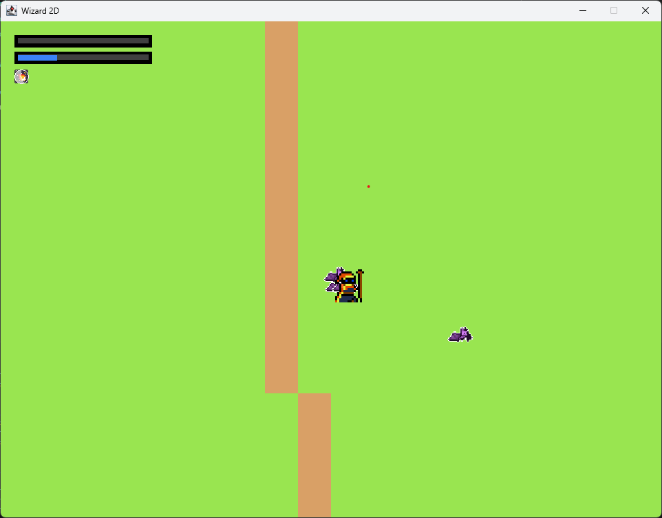

# 🎮 Wizard - 2D Java Game

> **Um jogo 2D feito do zero em Java vanilla sem engines!** ⚔️✨

  

## 🚀 Sobre o Projeto

**Wizard2D** é um jogo 2D desenvolvido inteiramente em Java puro, sem utilizar nenhum motor de jogo como Unity ou LibGDX. Uma experiência autêntica de desenvolvimento de games desde os fundamentos!

### ✨ Características Principais

- **🎯 Sistema de Combate**: Ataques básicos e habilidades especiais
- **👾 Sistema de Inimigos**: Mobs inteligentes com IA de perseguição e evasão
- **🌍 Mundo Gerado por Mapas**: Sistema de tilesets com colisão e navegação
- **📈 Sistema de Progressão**: Experiência, níveis e waves progressivas
- **🎥 Sistema de Câmera**: Seguimento suave com efeitos de shake
- **💫 Partículas e Efeitos**: Sistema de drops e animações
